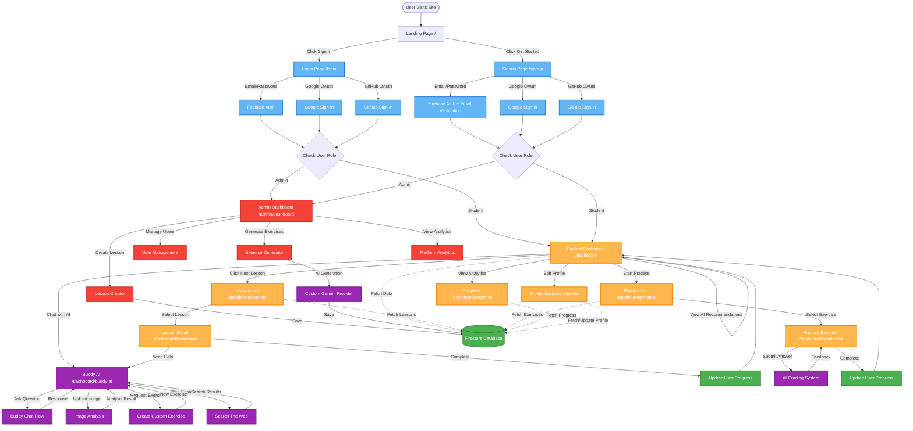

# AdaptEd AI - Complete Application Flow

## 🗺️ Application Flow Diagram



## 🎨 Flow Diagram Legend

| Color | Component Type | Description |
|-------|---------------|-------------|
| 🔵 Blue | Authentication | Login, signup, and auth providers |
| 🟠 Orange | Student Dashboard | Main student features and pages |
| 🟣 Purple | AI Features | AI-powered functionality |
| 🟢 Green | Data Layer | Database and state management |
| 🔴 Red | Admin Features | Admin-only functionality |

---

This document provides a comprehensive walkthrough of the entire user journey through the AdaptEd AI application, from the landing page to all major features.


---

## 1. 🏠 Landing Page (`/`)

**File**: [`src/app/page.tsx`](file:///Users/aman/Aman/hackathon-projects/AdaptEdAI/src/app/page.tsx)

### Design Philosophy
- **Japanese Zen-inspired minimalist design** with clean typography and subtle animations
- **Light/Dark mode support** via theme toggle
- **Smooth scroll progress indicator** at the top

### Key Sections

#### Navigation Bar
- **Logo**: AdaptEd branding with BookOpen icon
- **Links**: Philosophy, Experience, Harmony (scroll anchors)
- **Actions**: 
  - Sign In → `/login`
  - Get Started → `/signup`
- **Theme Toggle**: Switch between light/dark modes

#### Hero Section
- **Dynamic rotating concepts**: "Learn", "Grow", "Excel", "Achieve"
- **Main CTA**: "Begin Journey" → `/signup`
- **Stats Display**: 10,000 Students, 95% Success, ∞ Potential

#### Philosophy Section (`#philosophy`)
Three core principles with visual cards:
1. **Personalization** - AI adapts to individual learning patterns
2. **Simplicity** - Complex concepts made clear
3. **Growth** - Progress through practice

#### Visual Tools Section
Interactive tool showcase:
- **Code IDE**: Python code editor preview
- **LaTeX Math Board**: Mathematical expression rendering

#### Interactive Demo Section
Three-step demo carousel:
1. Ask Any Question
2. Get Instant Help
3. Track Progress

#### Experience Section (`#experience`)
Student testimonials with ratings and profiles

#### Harmony Section (`#harmony`)
Final call-to-action:
- "Start Your Practice" → `/signup`
- Benefits: Free, Instant, Simple

#### Footer
- Links: About, Privacy, Contact
- Copyright notice

#### Floating Elements
- **Floating Help Button**: Appears after scrolling, links to `/signup`
- **Progress Indicator**: Shows scroll progress

---

## 2. 🔐 Authentication Flow

### 2.1 Sign Up (`/signup`)

**File**: [`src/app/signup/page.tsx`](file:///Users/aman/Aman/hackathon-projects/AdaptEdAI/src/app/signup/page.tsx)

#### Features
- **Email/Password Registration**
  - Name, Email, Password fields
  - Password validation (min 6 characters)
  - Email verification sent automatically
  - Creates user profile in Firestore via `createUserInFirestore()`
  
- **Social Authentication**
  - Google OAuth
  - GitHub OAuth
  - Auto-creates profile if new user
  - Updates photo URL if existing user

#### User Flow
1. User fills form or clicks social login
2. Firebase Authentication creates account
3. `createUserInFirestore()` creates user document in Firestore
4. Email verification sent (for email/password)
5. Redirect to `/dashboard` (student) or `/admin/dashboard` (admin)

#### Error Handling
- Duplicate account detection
- Password strength validation
- Network error handling

---

### 2.2 Login (`/login`)

**File**: [`src/app/login/page.tsx`](file:///Users/aman/Aman/hackathon-projects/AdaptEdAI/src/app/login/page.tsx)

#### Features
- **Email/Password Login**
  - Email and password fields
  - "Forgot password?" functionality (sends reset email)
  
- **Social Login**
  - Google OAuth
  - GitHub OAuth
  - Creates profile if first-time social login

#### User Flow
1. User enters credentials or uses social login
2. Firebase Authentication validates
3. `getUser()` fetches user profile from Firestore
4. Role-based redirect:
   - Admin → `/admin/dashboard`
   - Student → `/dashboard`

#### Session Persistence
- Uses `browserLocalPersistence` for persistent sessions
- Users remain logged in across browser sessions

---

## 3. 📊 Student Dashboard (`/dashboard`)

**File**: [`src/app/dashboard/page.tsx`](file:///Users/aman/Aman/hackathon-projects/AdaptEdAI/src/app/dashboard/page.tsx)

**Layout**: [`src/app/dashboard/layout.tsx`](file:///Users/aman/Aman/hackathon-projects/AdaptEdAI/src/app/dashboard/layout.tsx)

### Dashboard Layout Structure

#### Authentication Guard
- `onAuthStateChanged` listener in layout
- Redirects to `/login` if not authenticated
- Calls `handleUserLogin()` to update last login timestamp

#### Navigation
**Component**: `DashboardNav`
- Logo and branding
- Navigation links:
  - Dashboard
  - Lessons
  - Practice
  - Buddy AI
  - Progress
  - Profile
- User menu with logout

#### Utility Sidebar
**Component**: `UtilitySidebar`
- Context-aware side panel
- Available via `UtilitySidebarProvider`

### Dashboard Main Page

#### Data Loading
On page load, fetches:
1. **User Profile** (`getUser()`)
2. **User Progress** (`getUserProgress()`)
3. **All Lessons** (`getLessons()`)
4. **AI Study Topics** (`generateStudyTopics()`)

#### Key Sections

##### 1. Welcome Header
- Personalized greeting: "Welcome back, [Name]!"
- Subtitle: "Let's continue your learning journey"

##### 2. Proactive AI Suggestion (if available)
- Alert banner with AI-generated message
- Actions:
  - "Chat Now" → `/dashboard/buddy-ai`
  - "Dismiss" → Clears suggestion

##### 3. Your Next Lesson (Hero Card)
- **Large featured card** (2 columns on desktop)
- Shows next uncompleted lesson
- Displays:
  - Lesson title
  - Subject badge
  - "Start Learning" CTA
- Links to `/dashboard/lessons/[id]`
- Falls back to "Review Completed Lessons" if all done

##### 4. AI Recommendations
- **AI-generated study topics** (3 suggestions)
- Loading skeleton while generating
- Each topic links to corresponding lesson
- Powered by `generateStudyTopics` flow

##### 5. Track Progress
- **Circular progress chart** showing exercise accuracy
- Calculation: `(correct / attempted) * 100`
- "View Details" → `/dashboard/progress`

##### 6. Practice Exercises Card
- Quick access to practice section
- "Start Practice" → `/dashboard/practice`

#### Visual Design
- **Glassmorphism** aesthetic with backdrop blur
- **SVG background** with gradient threads and glowing effects
- **Responsive grid** layout (1/2/4 columns)
- **Smooth animations** and hover effects

---

## 4. 📚 Lessons Section (`/dashboard/lessons`)

### Lessons List Page
**Expected Features**:
- Browse all available lessons
- Filter by subject
- See completion status
- Click to view lesson details

### Individual Lesson Page (`/dashboard/lessons/[id]`)
**Expected Features**:
- Lesson content display
- Interactive exercises
- Progress tracking
- AI-powered hints
- **No sidebar** (full-screen experience per layout config)

---

## 5. 🎯 Practice Section (`/dashboard/practice`)

### Practice List Page
**Expected Features**:
- Browse practice exercises
- Filter by difficulty/subject
- Adaptive difficulty system

### Individual Practice Page (`/dashboard/practice/[id]`)
**Expected Features**:
- Exercise questions (MCQ, True/False, Fill-in-the-blank, Long-form)
- Code editor for programming exercises
- Real-time feedback
- AI grading for open-ended answers
- **No sidebar** (full-screen experience per layout config)

---

## 6. 🤖 Buddy AI (`/dashboard/buddy-ai`)

**File**: Expected at `src/app/dashboard/buddy-ai/page.tsx`

### Features
- **AI Chat Interface** powered by custom Gemini integration
- **Flow**: [`src/ai/flows/buddy-chat.ts`](file:///Users/aman/Aman/hackathon-projects/AdaptEdAI/src/ai/flows/buddy-chat.ts)

### Capabilities
- **Conversational AI tutoring** with multiple personas
- **Tool-equipped AI** can:
  - Create custom exercises
  - Search the web
  - Analyze uploaded files (images, PDFs)
  - Access lesson context
  - View user progress

### Image Analysis
- **Direct vision analysis** for uploaded images
- Supports:
  - Math equations (step-by-step solutions)
  - Diagrams (explanations)
  - Charts/graphs (data interpretation)
  - Educational content (concept teaching)

### Layout
- **Full-height layout** (no padding, fills viewport)
- Utility sidebar available for additional tools

---

## 7. 📈 Progress Tracking (`/dashboard/progress`)

**Expected Features**:
- Detailed progress analytics
- Subject mastery breakdown
- Exercise accuracy over time
- Lesson completion timeline
- Visual charts and graphs

---

## 8. 👤 Profile (`/dashboard/profile`)

**Expected Features**:
- User information display
- Profile photo upload
- Account settings
- Learning preferences
- Password change
- Email verification status

---

## 9. 🔧 Admin Dashboard (`/admin/dashboard`)

**Directory**: `src/app/admin/`

### Admin Features
**Expected capabilities**:
- User management
- Lesson creation and editing
- Exercise generation
- Content moderation
- Analytics and reporting
- System configuration

### Access Control
- Role-based access (admin role required)
- Redirects non-admins to student dashboard

---

## 10. 🔄 State Management

### Authentication State
- **Firebase Auth** manages authentication
- `onAuthStateChanged` listeners in layouts
- Persistent sessions via `browserLocalPersistence`

### User Data
- **Firestore** stores user profiles, progress, lessons
- Real-time updates via `onSnapshot` (where applicable)
- Server Actions in `src/lib/actions.ts` for mutations

### AI State
- **Custom AI provider** (`src/ai/core/ai-provider.ts`)
- Flows defined in `src/ai/flows/`
- Tools in `src/ai/tools/`

---

## 11. 🎨 Design System

### Theme
- **Primary Color**: Calming blue (#64B5F6)
- **Accent Color**: Warm orange (#FFB74D)
- **Typography**: Inter font family
- **Dark Mode**: Full support with theme toggle

### UI Components
- **shadcn/ui** components in `src/components/ui/`
- **Radix UI** primitives
- **Tailwind CSS** for styling
- **Framer Motion** for animations

### Layout Patterns
- **Glassmorphism** with backdrop blur
- **Card-based** layouts
- **Responsive grids**
- **Smooth transitions**

---

## 12. 🚀 Navigation Flow Summary

```
Landing Page (/)
    ├─→ Sign Up (/signup)
    │       └─→ Dashboard (/dashboard) [after registration]
    │
    └─→ Login (/login)
            └─→ Dashboard (/dashboard) [student]
            └─→ Admin Dashboard (/admin/dashboard) [admin]

Dashboard (/dashboard)
    ├─→ Lessons (/dashboard/lessons)
    │       └─→ Lesson Detail (/dashboard/lessons/[id])
    │
    ├─→ Practice (/dashboard/practice)
    │       └─→ Practice Exercise (/dashboard/practice/[id])
    │
    ├─→ Buddy AI (/dashboard/buddy-ai)
    │
    ├─→ Progress (/dashboard/progress)
    │
    └─→ Profile (/dashboard/profile)
```

---

## 13. 🔐 Security Features

### Authentication
- Firebase Authentication with email/password and OAuth
- Email verification for new accounts
- Password reset functionality
- Session persistence

### Authorization
- Role-based access control (student/admin)
- Protected routes via layout guards
- Firestore security rules (in `firestore.rules`)

### Data Protection
- Server-side validation in Server Actions
- Input sanitization
- Environment variables for sensitive config

---

## 14. 📱 Responsive Design

### Breakpoints
- **Mobile**: Default (< 768px)
- **Tablet**: md (768px+)
- **Desktop**: lg (1024px+)

### Adaptive Layouts
- Grid columns adjust: 1 → 2 → 4
- Navigation collapses on mobile
- Full-screen modes for lesson/practice pages
- Touch-friendly interactions

---

## 15. ⚡ Performance Optimizations

### Loading States
- Skeleton loaders for async data
- Suspense boundaries
- Progressive enhancement

### Code Splitting
- Next.js automatic code splitting
- Dynamic imports for heavy components
- Route-based chunking

### Caching
- Firebase client-side caching
- Browser persistence for auth state
- Optimistic UI updates

---

## 16. 🧪 Key User Journeys

### New Student Journey
1. Land on homepage
2. Click "Get Started" or "Begin Journey"
3. Sign up with email or social auth
4. Redirected to dashboard
5. See AI-recommended next lesson
6. Click to start first lesson
7. Complete exercises
8. Chat with Buddy AI for help
9. Track progress over time

### Returning Student Journey
1. Visit site (already logged in)
2. Auto-redirected to dashboard
3. See personalized greeting
4. View progress and recommendations
5. Continue from next lesson
6. Practice exercises
7. Review progress analytics

### Admin Journey
1. Login with admin credentials
2. Redirected to admin dashboard
3. Manage content and users
4. Generate new lessons/exercises
5. Monitor platform analytics

---

## 17. 🔍 Special Features

### AI-Powered Features
- **Adaptive Study Topics**: AI generates personalized lesson recommendations
- **Buddy AI Chat**: Conversational tutoring with tool use
- **Image Analysis**: Upload and analyze educational images
- **Exercise Generation**: AI creates custom practice problems
- **Long-form Grading**: AI evaluates open-ended answers

### Real-time Features
- Live progress updates
- Instant AI responses
- Dynamic difficulty adjustment

### Accessibility
- Semantic HTML
- ARIA labels
- Keyboard navigation
- Screen reader support (via Radix UI)

---

## 18. 📂 Key Files Reference

| Feature | File Path |
|---------|-----------|
| Landing Page | [src/app/page.tsx](file:///Users/aman/Aman/hackathon-projects/AdaptEdAI/src/app/page.tsx) |
| Login | [src/app/login/page.tsx](file:///Users/aman/Aman/hackathon-projects/AdaptEdAI/src/app/login/page.tsx) |
| Signup | [src/app/signup/page.tsx](file:///Users/aman/Aman/hackathon-projects/AdaptEdAI/src/app/signup/page.tsx) |
| Dashboard | [src/app/dashboard/page.tsx](file:///Users/aman/Aman/hackathon-projects/AdaptEdAI/src/app/dashboard/page.tsx) |
| Dashboard Layout | [src/app/dashboard/layout.tsx](file:///Users/aman/Aman/hackathon-projects/AdaptEdAI/src/app/dashboard/layout.tsx) |
| Buddy AI Flow | [src/ai/flows/buddy-chat.ts](file:///Users/aman/Aman/hackathon-projects/AdaptEdAI/src/ai/flows/buddy-chat.ts) |
| AI Provider | [src/ai/core/ai-provider.ts](file:///Users/aman/Aman/hackathon-projects/AdaptEdAI/src/ai/core/ai-provider.ts) |
| Data Layer | [src/lib/data.ts](file:///Users/aman/Aman/hackathon-projects/AdaptEdAI/src/lib/data.ts) |
| Firebase Config | [src/lib/firebase.ts](file:///Users/aman/Aman/hackathon-projects/AdaptEdAI/src/lib/firebase.ts) |

---

## 19. 🎯 Next Steps for Users

### For Students
1. Complete profile setup
2. Browse available lessons
3. Start with AI-recommended topics
4. Practice regularly
5. Chat with Buddy AI when stuck
6. Track progress weekly

### For Admins
1. Review user analytics
2. Create new lesson content
3. Generate practice exercises
4. Monitor student progress
5. Adjust content difficulty

---

This comprehensive flow document covers the entire user journey through AdaptEd AI, from first visit to advanced features. The application provides a seamless, AI-powered learning experience with beautiful design and robust functionality.
