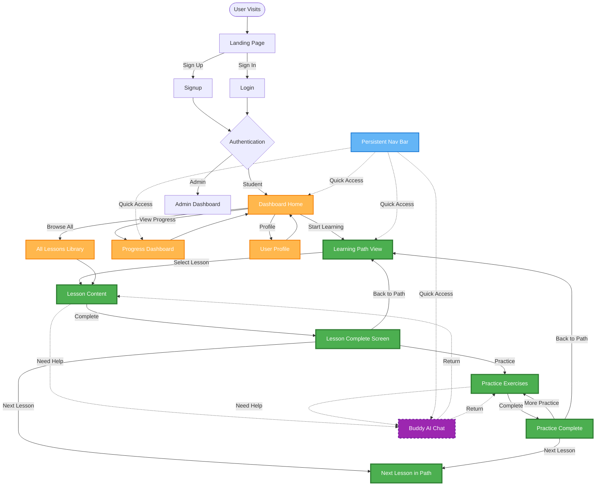

# AdaptEd AI - Flow Simplification Implementation Plan

## 📋 Executive Summary

After deep analysis of the current application flow, I've identified that the **post-dashboard navigation is overly complex** with too many interconnected paths, making it confusing for users to understand where they are and where they can go next.

**Current Issues**:
1. ❌ **Too many entry points** - Dashboard has 6+ different navigation paths
2. ❌ **Unclear hierarchy** - Lessons, Practice, and Buddy AI feel disconnected
3. ❌ **No clear learning path** - Users don't know what to do after completing a lesson
4. ❌ **Forced returns to dashboard** - Breaks learning flow momentum
5. ❌ **Buddy AI feels isolated** - Not integrated into the learning journey

---

## 🔍 Current Flow Analysis

### **What Works Well** ✅
- Landing → Signup → Login → Dashboard is **clean and clear**
- Authentication flow is **professional**
- Role-based routing (admin/student) is **well-implemented**

### **What's Messy** ❌

Looking at your uploaded flow diagram, the post-dashboard section shows:
- **Multiple disconnected branches** (Lessons, Practice, Buddy AI, Progress, Profile)
- **Circular dependencies** (everything loops back to dashboard)
- **No clear primary path** - all features feel equal weight
- **Complex interconnections** between Firestore, AI flows, and components

---

## 🎯 Proposed Simplified Flow

### **Core Principle**: **Linear Learning Journey with Optional Branches**

Instead of a hub-and-spoke model (dashboard as central hub), we'll create a **primary learning path** with **contextual access** to supporting features.



---

## 🎨 Key Improvements

### **1. Primary Learning Path** 🟢
**What**: A clear, linear progression through lessons and practice.

**How**:
- Dashboard shows "Your Learning Path" as the primary CTA
- Learning Path view shows a visual progression (e.g., "Lesson 3 of 12 in Mathematics")
- After completing a lesson, user sees:
  - ✅ Completion celebration
  - 🎯 Next lesson preview
  - 💪 Practice exercises for this topic
  - 🏠 Return to path overview

**Benefit**: Users always know what to do next.

---

### **2. Contextual Buddy AI** 🟣
**What**: Buddy AI is accessible from within lessons and practice, not a separate destination.

**How**:
- Floating "Ask Buddy" button on lesson and practice pages
- Opens as a **side panel** or **modal**, not a new page
- Context-aware: Buddy knows what lesson/exercise you're on
- Can return to lesson without losing place

**Benefit**: Help is available when needed, without breaking flow.

---

### **3. Simplified Dashboard** 🟡
**What**: Dashboard becomes a "home base" with clear priorities.

**Current Dashboard** (6 sections):
1. Welcome message
2. Proactive AI suggestion
3. Next lesson (hero)
4. AI recommendations (3 topics)
5. Progress chart
6. Practice exercises card

**New Dashboard** (3 sections):
1. **Your Learning Path** (primary CTA)
   - Current lesson with progress bar
   - "Continue Learning" button
2. **Quick Stats** (compact)
   - Lessons completed: 5/12
   - Practice accuracy: 85%
   - Current streak: 3 days
3. **Recent Activity** (optional)
   - Last 3 completed items

**Benefit**: Less overwhelming, clearer priorities.

---

### **4. Persistent Navigation** 🔵
**What**: Always-visible navigation bar with key destinations.

**Items**:
- 🏠 Home (Dashboard)
- 📚 My Path (Learning Path)
- 🤖 Buddy AI (opens panel)
- 📊 Progress
- 👤 Profile

**Benefit**: Users can jump to any section without returning to dashboard.

---

## 📐 Implementation Phases

### **Phase 1: Foundation** (Week 1)
**Goal**: Create the Learning Path concept

**Tasks**:
1. Create `LearningPathContext` to track user's current position
2. Design Learning Path view component
3. Update lesson completion to suggest next lesson
4. Add breadcrumb navigation

**Files to Create**:
- `src/contexts/LearningPathContext.tsx`
- `src/app/dashboard/learning-path/page.tsx`
- `src/components/dashboard/LessonCompleteScreen.tsx`

**Files to Modify**:
- `src/app/dashboard/page.tsx` (simplify dashboard)
- `src/app/dashboard/lessons/[id]/page.tsx` (add completion screen)

**Estimated Effort**: 15-20 hours

---

### **Phase 2: Contextual Buddy AI** (Week 2)
**Goal**: Make Buddy AI accessible from within lessons

**Tasks**:
1. Convert Buddy AI page to a reusable component
2. Create floating "Ask Buddy" button
3. Implement side panel/modal for Buddy AI
4. Add context awareness (current lesson/exercise)

**Files to Create**:
- `src/components/buddy-ai/BuddyAIPanel.tsx`
- `src/components/buddy-ai/FloatingBuddyButton.tsx`

**Files to Modify**:
- `src/app/dashboard/lessons/[id]/page.tsx` (add Buddy button)
- `src/app/dashboard/practice/[id]/page.tsx` (add Buddy button)
- `src/app/dashboard/buddy-ai/page.tsx` (refactor to use shared component)

**Estimated Effort**: 12-15 hours

---

### **Phase 3: Dashboard Simplification** (Week 3)
**Goal**: Reduce dashboard complexity

**Tasks**:
1. Redesign dashboard with 3 sections
2. Create "Your Learning Path" card
3. Simplify progress display
4. Remove redundant sections

**Files to Modify**:
- `src/app/dashboard/page.tsx` (major refactor)

**Estimated Effort**: 8-10 hours

---

### **Phase 4: Persistent Navigation** (Week 4)
**Goal**: Add always-visible navigation

**Tasks**:
1. Update `DashboardNav` component
2. Add active state indicators
3. Implement keyboard shortcuts (optional)
4. Mobile-responsive navigation

**Files to Modify**:
- `src/components/dashboard/DashboardNav.tsx`
- `src/app/dashboard/layout.tsx`

**Estimated Effort**: 6-8 hours

---

### **Phase 5: Polish & Testing** (Week 5)
**Goal**: Refine and validate changes

**Tasks**:
1. User testing with 5-10 users
2. Gather feedback
3. Iterate on design
4. Performance optimization
5. Accessibility audit

**Estimated Effort**: 10-12 hours

---

## 📊 Before & After Comparison

| Aspect | Current (Messy) | Proposed (Clean) |
|--------|----------------|------------------|
| **Dashboard Sections** | 6 sections | 3 sections |
| **Primary CTA** | Unclear (multiple equal-weight options) | Clear ("Continue Learning") |
| **Lesson → Lesson** | Return to dashboard → select next | Direct "Next Lesson" button |
| **Buddy AI Access** | Separate page, lose context | Contextual panel, keep context |
| **Navigation Depth** | 3-4 clicks to get anywhere | 1-2 clicks max |
| **User Confusion** | "What should I do next?" | Clear next steps always visible |

---

## 🎯 Success Metrics

### **Quantitative**
- ✅ **Reduce clicks to next lesson**: From 3 → 1
- ✅ **Increase lesson completion rate**: Target +20%
- ✅ **Reduce dashboard bounce rate**: Target -30%
- ✅ **Increase Buddy AI usage**: Target +40% (easier access)

### **Qualitative**
- ✅ Users can explain their learning path
- ✅ Users know what to do next without thinking
- ✅ Buddy AI feels integrated, not separate
- ✅ Dashboard feels calm, not overwhelming

---

## 🚨 Risks & Mitigation

### **Risk 1: User Resistance to Change**
**Mitigation**: 
- Gradual rollout (feature flag)
- Keep old dashboard as "Classic View" option
- Clear onboarding for new flow

### **Risk 2: Breaking Existing User Habits**
**Mitigation**:
- Preserve all existing functionality
- Add new features alongside old ones
- Provide migration guide

### **Risk 3: Development Complexity**
**Mitigation**:
- Phased approach (5 weeks)
- Each phase is independently valuable
- Can pause/adjust between phases

---

## 🛠️ Technical Considerations

### **State Management**
**Current**: Each page manages its own state  
**Proposed**: Shared `LearningPathContext` for cross-page state

```typescript
// src/contexts/LearningPathContext.tsx
interface LearningPathState {
  currentLessonId: string | null;
  completedLessonIds: string[];
  nextLessonId: string | null;
  pathProgress: number; // 0-100
}
```

### **Data Fetching**
**Current**: Each page fetches data independently  
**Proposed**: Prefetch next lesson data for instant navigation

```typescript
// Prefetch next lesson when current lesson loads
useEffect(() => {
  if (nextLessonId) {
    prefetchLesson(nextLessonId);
  }
}, [nextLessonId]);
```

### **Buddy AI Integration**
**Current**: Full-page component  
**Proposed**: Reusable component with context injection

```typescript
// src/components/buddy-ai/BuddyAIPanel.tsx
interface BuddyAIPanelProps {
  context?: {
    lessonId?: string;
    exerciseId?: string;
    currentTopic?: string;
  };
  onClose: () => void;
}
```

---

## 📝 Detailed File Changes

### **Phase 1 Files**

#### **NEW: `src/contexts/LearningPathContext.tsx`**
```typescript
import { createContext, useContext, useState, useEffect } from 'react';
import { getLessons, getUserProgress } from '@/lib/data';

interface LearningPathContextType {
  currentLesson: Lesson | null;
  nextLesson: Lesson | null;
  progress: number;
  totalLessons: number;
  completedCount: number;
  goToNextLesson: () => void;
}

export const LearningPathContext = createContext<LearningPathContextType | null>(null);

export function LearningPathProvider({ children, userId }: { children: React.ReactNode; userId: string }) {
  // Implementation
}

export const useLearningPath = () => {
  const context = useContext(LearningPathContext);
  if (!context) throw new Error('useLearningPath must be used within LearningPathProvider');
  return context;
};
```

#### **NEW: `src/app/dashboard/learning-path/page.tsx`**
```typescript
export default function LearningPathPage() {
  const { currentLesson, nextLesson, progress, totalLessons } = useLearningPath();
  
  return (
    <div>
      <h1>Your Learning Path</h1>
      <ProgressBar value={progress} max={100} />
      <p>{completedCount} of {totalLessons} lessons completed</p>
      
      {currentLesson && (
        <LessonCard lesson={currentLesson} isCurrent />
      )}
      
      {nextLesson && (
        <LessonCard lesson={nextLesson} isNext />
      )}
      
      {/* Visual path timeline */}
      <LessonTimeline lessons={allLessons} currentId={currentLesson?.id} />
    </div>
  );
}
```

#### **NEW: `src/components/dashboard/LessonCompleteScreen.tsx`**
```typescript
export function LessonCompleteScreen({ 
  lesson, 
  nextLesson, 
  onContinue, 
  onPractice, 
  onBackToPath 
}: Props) {
  return (
    <div className="celebration-screen">
      <h2>🎉 Lesson Complete!</h2>
      <p>You've mastered: {lesson.title}</p>
      
      <div className="next-steps">
        {nextLesson && (
          <Button onClick={onContinue} size="lg">
            Continue to: {nextLesson.title}
          </Button>
        )}
        
        <Button onClick={onPractice} variant="secondary">
          Practice Exercises
        </Button>
        
        <Button onClick={onBackToPath} variant="outline">
          Back to Learning Path
        </Button>
      </div>
    </div>
  );
}
```

#### **MODIFY: `src/app/dashboard/page.tsx`**
**Changes**:
- Remove AI recommendations section
- Remove proactive AI suggestion banner
- Simplify to 3 sections:
  1. Your Learning Path (primary)
  2. Quick Stats (compact)
  3. Recent Activity (optional)

**Lines to change**: ~100-150 lines (major refactor)

---

### **Phase 2 Files**

#### **NEW: `src/components/buddy-ai/BuddyAIPanel.tsx`**
```typescript
export function BuddyAIPanel({ 
  context, 
  onClose, 
  isOpen 
}: BuddyAIPanelProps) {
  // Reuse logic from buddy-ai/page.tsx
  // Add context injection for current lesson/exercise
  
  return (
    <Sheet open={isOpen} onOpenChange={onClose}>
      <SheetContent side="right" className="w-full md:w-[600px]">
        {/* Buddy AI chat interface */}
      </SheetContent>
    </Sheet>
  );
}
```

#### **NEW: `src/components/buddy-ai/FloatingBuddyButton.tsx`**
```typescript
export function FloatingBuddyButton({ onClick }: { onClick: () => void }) {
  return (
    <Button
      onClick={onClick}
      className="fixed bottom-6 right-6 rounded-full shadow-lg"
      size="lg"
    >
      <Bot className="mr-2" />
      Ask Buddy
    </Button>
  );
}
```

---

## 🎨 Design Mockups Needed

### **1. Learning Path View**
- Visual timeline of lessons
- Current lesson highlighted
- Progress bar
- Next lesson preview

### **2. Lesson Complete Screen**
- Celebration animation
- Stats (time spent, score)
- Clear next steps

### **3. Simplified Dashboard**
- "Your Learning Path" hero card
- Compact stats
- Recent activity list

### **4. Buddy AI Panel**
- Side panel design
- Context indicator ("Helping with: Lesson 3")
- Quick close button

---

## 📅 Timeline Summary

| Phase | Duration | Effort | Deliverable |
|-------|----------|--------|-------------|
| Phase 1: Learning Path | Week 1 | 15-20h | Learning Path view, completion screen |
| Phase 2: Contextual Buddy | Week 2 | 12-15h | Buddy AI panel, floating button |
| Phase 3: Dashboard Simplification | Week 3 | 8-10h | Redesigned dashboard |
| Phase 4: Persistent Nav | Week 4 | 6-8h | Updated navigation bar |
| Phase 5: Polish & Testing | Week 5 | 10-12h | Refined, tested product |
| **Total** | **5 weeks** | **51-65 hours** | **Simplified, clear flow** |

---

## 🚀 Next Steps

### **Immediate Actions**:
1. **Review this plan** - Discuss with team/stakeholders
2. **Prioritize phases** - Can we do Phase 1 first and pause?
3. **Design mockups** - Create visual designs for new components
4. **User research** - Validate assumptions with 3-5 users
5. **Set up feature flags** - Prepare for gradual rollout

### **Questions to Answer**:
1. Do we want to keep the old dashboard as a "Classic View" option?
2. Should Buddy AI be a side panel or modal?
3. What's the priority: Learning Path or Contextual Buddy AI?
4. Can we do a phased rollout (50% of users get new flow)?
5. What metrics will we track to measure success?

---

## 💡 Key Takeaway

**The current flow isn't broken, it's just cluttered.** By introducing a **clear primary path** (Learning Path) and making supporting features **contextual** (Buddy AI), we can dramatically improve user experience without removing any functionality.

**This is a refinement, not a rebuild.**

---

## 📎 Appendix: Current vs Proposed Flow Comparison

### **Current Flow** (From Your Diagram)
```
Dashboard → [6 equal-weight options]
  ├─ Lessons → Lesson Detail → Dashboard
  ├─ Practice → Exercise → Dashboard
  ├─ Buddy AI → Chat → Dashboard
  ├─ Progress → Dashboard
  ├─ Profile → Dashboard
  └─ AI Recommendations → Lesson → Dashboard
```

### **Proposed Flow**
```
Dashboard → Learning Path → Lesson → Complete Screen
                                        ├─ Next Lesson (direct)
                                        ├─ Practice (direct)
                                        └─ Back to Path

Buddy AI: Accessible from anywhere via floating button
Progress, Profile: Always accessible via persistent nav
```

**Difference**: Linear primary path with contextual branches, not a hub-and-spoke model.
