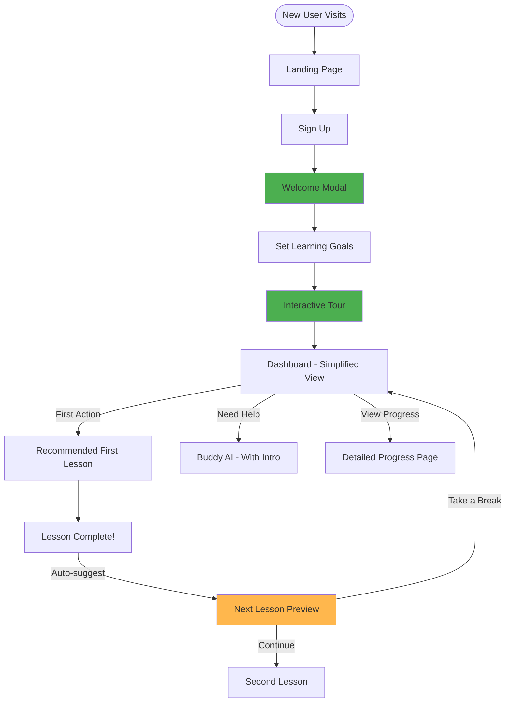

# AdaptEd AI - UX Flow Analysis & Critique

## Executive Summary

**Overall Assessment**: ⭐⭐⭐⭐☆ (4/5 - **Good, with room for improvement**)

The application demonstrates a **mature, well-thought-out user experience** with strong AI integration and beautiful design. However, there are some areas that feel **slightly forced** or could benefit from refinement to create a more natural, intuitive flow.

---

## 🎯 Strengths (What Works Well)

### 1. **Landing Page - Excellent First Impression**
✅ **Zen-inspired minimalist design** creates immediate trust and sophistication  
✅ **Clear value proposition** - "Wisdom, Learn, Grow, Excel, Achieve"  
✅ **Multiple CTAs** strategically placed (hero, floating button, harmony section)  
✅ **Social proof** with stats (10,000 students, 95% success)  
✅ **Progressive disclosure** - scroll-based content revelation  
✅ **Smooth animations** without being distracting  

**Verdict**: 🟢 **Natural and polished**

---

### 2. **Authentication Flow - Seamless**
✅ **Multiple auth options** (Email, Google, GitHub) reduce friction  
✅ **Forgot password** functionality built-in  
✅ **Auto-redirect** based on role (admin vs student)  
✅ **Email verification** for security  
✅ **Persistent sessions** - users stay logged in  
✅ **Error handling** with clear messages  

**Verdict**: 🟢 **Professional and complete**

---

### 3. **Dashboard - Personalized & Engaging**
✅ **Personalized greeting** - "Welcome back, [Name]!"  
✅ **AI-powered recommendations** - smart next lesson suggestion  
✅ **Clear visual hierarchy** - hero card for next lesson  
✅ **Progress visualization** - circular chart is intuitive  
✅ **Proactive AI suggestions** - Buddy AI reaches out  
✅ **Beautiful glassmorphism** design with SVG backgrounds  

**Verdict**: 🟢 **Engaging and well-designed**

---

### 4. **AI Integration - Standout Feature**
✅ **Buddy AI** as a persistent learning companion  
✅ **Image analysis** for visual learning  
✅ **Custom exercise generation** on-demand  
✅ **Web search integration** for current information  
✅ **Adaptive difficulty** based on performance  

**Verdict**: 🟢 **Innovative and valuable**

---

## ⚠️ Weaknesses & Areas of Concern

### 1. **Onboarding - Missing Critical Step** 🔴
**Issue**: New users jump straight to dashboard after signup with **no onboarding or tutorial**.

**Why it feels forced/immature**:
- Users don't know what to do first
- No explanation of Buddy AI or key features
- No goal-setting or preference selection
- Feels like being thrown into the deep end

**Impact**: 😕 **Confusing for first-time users**

**Recommendation**:
```
Signup → Welcome Modal → Quick Tutorial → Goal Selection → Dashboard
```
- Show a 3-step interactive tour
- Ask about learning goals and subjects of interest
- Introduce Buddy AI with a sample interaction
- Let users skip if they prefer

---

### 2. **Dashboard - Information Overload** 🟡
**Issue**: Dashboard shows **too much at once** without clear prioritization.

**Current layout**:
- Welcome message
- Proactive AI suggestion (if any)
- Next lesson (hero card)
- AI recommendations (3 topics)
- Progress chart
- Practice exercises card

**Why it feels forced**:
- 6 different sections competing for attention
- No clear "start here" guidance
- AI recommendations might not align with user intent
- Progress chart shows 0% for new users (discouraging)

**Impact**: 😐 **Overwhelming, especially for new users**

**Recommendation**:
- **Progressive disclosure**: Show 2-3 key items initially
- **Contextual help**: "New here? Start with this lesson"
- **Empty state design**: Better messaging for 0% progress
- **Collapsible sections**: Let users hide what they don't need

---

### 3. **AI Recommendations - Feels Automated** 🟡
**Issue**: AI-generated study topics appear **without user request** and may not match intent.

**Why it feels forced**:
- Users didn't ask for recommendations
- No explanation of why these topics were chosen
- Can't customize or refresh recommendations
- Feels like the AI is "pushing" content

**Impact**: 😐 **Can feel intrusive rather than helpful**

**Recommendation**:
- Add "Why this?" tooltip explaining AI reasoning
- "Refresh recommendations" button
- "Not interested" option to improve future suggestions
- Make it opt-in: "Get AI recommendations?"

---

### 4. **Navigation Flow - Some Friction** 🟡
**Issue**: Users must return to dashboard between lessons/exercises.

**Current flow**:
```
Dashboard → Lesson → Complete → Dashboard → Next Lesson
```

**Why it feels forced**:
- Extra clicks to continue learning
- Breaks flow state
- Dashboard becomes a "hub" rather than a "home"

**Impact**: 😐 **Interrupts learning momentum**

**Recommendation**:
```
Lesson → Complete → "Next Lesson" CTA → Directly to next lesson
```
- Add "Continue Learning" button at lesson completion
- Show next recommended lesson inline
- Option to "Return to Dashboard" if needed
- Reduce friction in the learning flow

---

### 5. **Proactive AI Suggestions - Timing Issues** 🟡
**Issue**: Proactive AI messages appear on dashboard **without clear trigger**.

**Why it feels forced**:
- Users don't know why Buddy AI is messaging them
- No context for when/why suggestions appear
- Can feel like spam if too frequent
- Dismissing doesn't provide feedback mechanism

**Impact**: 😐 **Can feel random or annoying**

**Recommendation**:
- Clear triggers: "You haven't practiced in 3 days"
- Frequency limits: Max 1 per day
- User preferences: "How often should Buddy AI check in?"
- Feedback: "Was this helpful?" after dismissing

---

### 6. **Progress Tracking - Limited Visibility** 🟡
**Issue**: Progress is shown as a **single percentage** without context.

**Why it feels immature**:
- No breakdown by subject
- No historical trend (improving or declining?)
- No comparison to goals or peers
- Just a number without story

**Impact**: 😐 **Not actionable or motivating**

**Recommendation**:
- Show subject-wise breakdown on dashboard
- Add trend indicator: ↑ +5% this week
- Link to detailed progress page with charts
- Celebrate milestones: "You've improved 20%!"

---

### 7. **Landing Page → Dashboard Disconnect** 🟡
**Issue**: Landing page promises "effortless learning" but dashboard feels **task-oriented**.

**Why it feels forced**:
- Landing page: Zen, calm, philosophical
- Dashboard: Busy, data-heavy, action-focused
- Tonal shift is jarring

**Impact**: 😐 **Expectation mismatch**

**Recommendation**:
- Bring Zen aesthetic into dashboard
- Use calming language: "Your next step" vs "Start Learning"
- Add breathing room with more whitespace
- Maintain design consistency

---

## 🔍 Detailed Flow Analysis

### **Landing Page → Signup Flow** 🟢
**Rating**: 9/10 - Excellent

**What works**:
- Multiple CTAs without being pushy
- Clear value proposition
- Beautiful design builds trust
- Social proof reduces hesitation

**Minor improvement**:
- Add "See it in action" demo video
- Show sample lesson preview

---

### **Signup → Dashboard Flow** 🔴
**Rating**: 5/10 - Needs work

**What's missing**:
- No welcome message or celebration
- No onboarding tutorial
- No goal-setting step
- Straight to complex dashboard

**Feels**: Rushed and impersonal

**Fix**:
```
Signup Success → Welcome Modal → "What do you want to learn?" → 
Quick Tour → Dashboard with contextual help
```

---

### **Dashboard → Lesson Flow** 🟡
**Rating**: 7/10 - Good but could be smoother

**What works**:
- Clear next lesson recommendation
- AI-powered suggestions
- Beautiful card design

**What's awkward**:
- Must return to dashboard after each lesson
- No "learning path" visualization
- Can't see what's coming next

**Fix**:
- Add breadcrumb: "Lesson 3 of 12 in Mathematics"
- Show next lesson preview at completion
- "Continue Learning" button

---

### **Dashboard → Buddy AI Flow** 🟢
**Rating**: 8/10 - Strong

**What works**:
- Accessible from anywhere
- Proactive suggestions
- Multiple interaction modes

**Minor improvement**:
- Add quick tips on first visit
- Show example questions
- Explain what Buddy AI can do

---

### **Practice Flow** 🟡
**Rating**: 6/10 - Functional but could be better

**Assumptions** (based on code structure):
- User selects exercise
- Completes questions
- Gets AI feedback
- Returns to dashboard

**Potential issues**:
- No clear progression through exercises
- Feedback might feel delayed (AI processing)
- No immediate gratification

**Recommendations**:
- Instant feedback for MCQs
- Progress bar: "3 of 10 questions"
- Streak tracking: "5 days in a row!"
- Gamification elements

---

## 🎨 Design Consistency Analysis

### **Visual Design** 🟢
**Rating**: 9/10 - Excellent

**Strengths**:
- Consistent color palette
- Beautiful glassmorphism
- Smooth animations
- Professional typography

**Minor issues**:
- Landing page uses gray tones, dashboard uses theme colors
- Some inconsistency in button styles

---

### **Tone & Voice** 🟡
**Rating**: 7/10 - Good but inconsistent

**Landing page**: Philosophical, calm, inspiring  
**Dashboard**: Functional, direct, task-oriented  
**Buddy AI**: Friendly, helpful, conversational  

**Issue**: Tonal shifts between sections

**Fix**: Unify voice across all touchpoints

---

## 🚀 Maturity Assessment

### **What Feels Mature** ✅
1. **Authentication system** - Professional and complete
2. **AI integration** - Sophisticated and well-implemented
3. **Visual design** - Polished and modern
4. **Data architecture** - Well-structured (Firestore, Firebase)
5. **Role-based access** - Proper admin/student separation

### **What Feels Immature** ⚠️
1. **Onboarding** - Non-existent
2. **User guidance** - Minimal contextual help
3. **Error states** - Not visible in flow
4. **Empty states** - Could be more encouraging
5. **Feedback loops** - Limited user input on AI suggestions

### **What Feels Forced** 🔴
1. **AI recommendations** - Appear without request
2. **Proactive suggestions** - Timing feels arbitrary
3. **Dashboard hub model** - Forces return after each action
4. **Progress metric** - Single number without context

---

## 📊 User Journey Quality Scores

| Journey | Score | Verdict |
|---------|-------|---------|
| Landing → Signup | 9/10 | 🟢 Excellent |
| Signup → Dashboard | 5/10 | 🔴 Needs work |
| Dashboard → Lesson | 7/10 | 🟡 Good |
| Lesson → Lesson | 6/10 | 🟡 Could be smoother |
| Dashboard → Buddy AI | 8/10 | 🟢 Strong |
| Dashboard → Practice | 7/10 | 🟡 Good |
| Progress Tracking | 6/10 | 🟡 Needs depth |

**Overall Average**: 6.9/10 - **Good, not great**

---

## 🎯 Priority Recommendations

### **High Priority** (Do First) 🔴
1. **Add onboarding flow** for new users
2. **Simplify dashboard** for first-time visitors
3. **Add "Continue Learning"** button to reduce dashboard returns
4. **Improve empty states** (0% progress, no lessons completed)
5. **Add contextual help** tooltips throughout

### **Medium Priority** (Do Soon) 🟡
1. **Explain AI recommendations** with "Why this?" tooltips
2. **Add progress trends** (↑ improving, → stable, ↓ declining)
3. **Unify tone and voice** across landing page and dashboard
4. **Add learning path visualization** (breadcrumbs, progress bars)
5. **Improve proactive AI timing** with clear triggers

### **Low Priority** (Nice to Have) 🟢
1. Add demo video on landing page
2. Gamification elements (streaks, badges)
3. Peer comparison (optional, privacy-respecting)
4. Dark mode improvements
5. Mobile app hints

---

## 🏆 Final Verdict

### **Overall Assessment**: 7.5/10 - **Good Product, Needs Polish**

**Strengths**:
- ✅ Beautiful, professional design
- ✅ Sophisticated AI integration
- ✅ Solid technical foundation
- ✅ Clear value proposition

**Weaknesses**:
- ⚠️ Missing onboarding
- ⚠️ Some forced interactions (AI recommendations, dashboard hub)
- ⚠️ Overwhelming for new users
- ⚠️ Limited contextual guidance

### **Does it feel forced?**
**Partially, yes.** Specifically:
- AI recommendations appearing unsolicited
- Forcing users back to dashboard between lessons
- Proactive AI suggestions without clear triggers

### **Does it feel immature?**
**In some areas, yes.** Specifically:
- No onboarding for new users
- Limited error/empty state handling
- Progress tracking lacks depth
- Missing contextual help

### **Is it good?**
**Yes, it's good!** The core experience is solid, the AI features are innovative, and the design is beautiful. With the recommended improvements, this could easily be an **8.5-9/10 product**.

---

## 🎬 Recommended User Flow (Improved)



---

## 💡 Key Takeaway

**AdaptEd AI is a well-built product with strong fundamentals.** The main issues are around **user guidance and flow friction**, not technical quality. With focused UX improvements—especially onboarding, contextual help, and smoother lesson-to-lesson flow—this could be an exceptional learning platform.

**Bottom line**: It's **good**, not **great**. But it's **very close** to being great.
